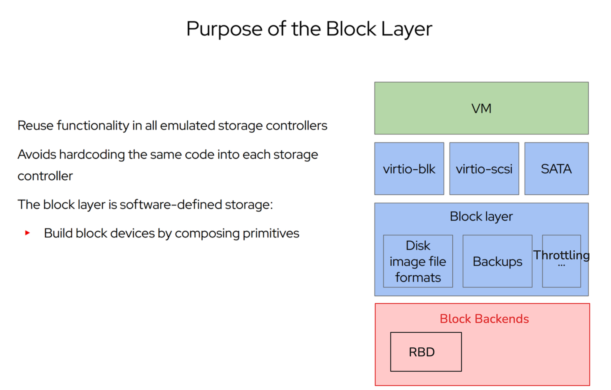
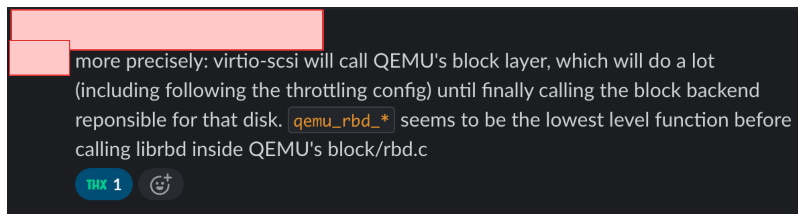
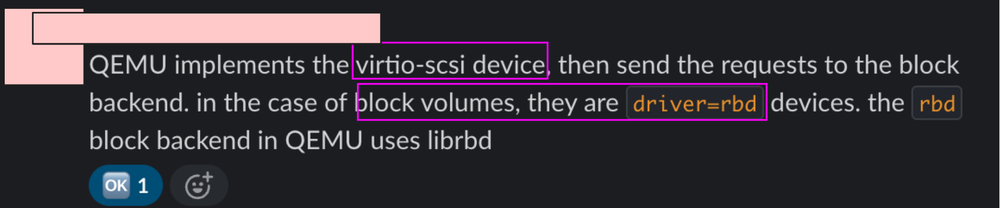

# QEMU background

See the QEMU architecture


When a guest makes a block read/write/flush/discard via a syscall, then the request is handled in the QEMU `emulator` (I THINK) (`qemu-system-x86_64`) thread
running the `virtio-scsi` layer. The main entrypoint in teh SCSI-layer is in [scsi_disk_emulate_command](https://github.com/qemu/qemu/blob/master/hw/scsi/scsi-disk.c#L2010) (SYNCHRONIZE_CACHES, TRIM, ...) and [`scsi_disk_dma_command`](https://github.com/qemu/qemu/blob/master/hw/scsi/scsi-disk.c#L2295) (READ_X, WRITE_X, ..) (the main mapping can be found [here](https://github.com/qemu/qemu/blob/master/hw/scsi/scsi-disk.c#L2644-L2664)

Requests that cannot be directly emulated and need to involve the block layer, the SCSI layer calls the SCSI layer calls `blk_aio_*` functions (for read/write/flush/) e.g [here for write](https://github.com/qemu/qemu/blob/master/hw/scsi/scsi-disk.c#L3117).
Then the request passes the block layer (including potential throttling according to the libvirt domain XML) until the configured block backend (here: `rbd`) is called.
The main entry point for the `rbd` block-backend is for each read/write/flush/discard/write-zeros in the file `block/rbd.c` e.g for `flush` [here](https://github.com/qemu/qemu/blob/master/block/rbd.c#L1381).
- each rbd r/w/d/f function is executed in a separate coroutine
- each coroutine then creates a completion function via the shared library `librbd` and then calls the library function `rbd_aio_{readv/writev/discard/flush}` handing over the completion
- the completion function is called by `librbd` when the IO call is complete, which then wakes up the yielding coroutine.

Then the request "travels up" to the SCSI layer again where the completion function (either for the emulated or the dma command e.g [scsi_aio_complete](https://github.com/qemu/qemu/blob/master/hw/scsi/scsi-disk.c#L344) and [scsi_dma_complete](https://github.com/qemu/qemu/blob/master/hw/scsi/scsi-disk.c#L407)) is called.
- you can see the used completion function in the code for each operation e.g for SCSI read [here](https://github.com/qemu/qemu/blob/master/hw/scsi/scsi-disk.c#L480) the completion function `scsi_dma_complete` is used.


**Understanding**: droplet guests are configured with the `virtio-scsi` emulated storage device (NOT with `virtio-blk`).

**Result**: `virtio-blk` code is not instrumented when guests make block r/w requests to the exposed scsi block device


A knowledgeable colleague explained how the SCSI layer interacts with the block layer (of which RDB is a partiuclar backend)





## Prerequisites

We want to use `uprobes`, which are tracepoints attached to user-space function names (here: the binary `/usr/bin/qemu-system-x86_64` or a shared library). 
Hence, we need to have the qemu binary with debug symbols (either compiled-in, or provided via pacakge).

```bash
dfoehr@mine:~$ sudo apt install qemu-dbg
```

Now, we can see that bpftrace can read the symbol table (ELF) to get the function names
```go
# after installing the symbols, we should find the function names
dfoehr@s2r1node100:~/bpftrace_tools$ sudo bpftrace -l 'uprobe:/usr/bin/qemu-system-x86_64:*rbd*'

# below are the functions used for each individual RDB command
uprobe:/usr/bin/qemu-system-x86_64:qemu_rbd_co_flush
uprobe:/usr/bin/qemu-system-x86_64:qemu_rbd_co_invalidate_cache
uprobe:/usr/bin/qemu-system-x86_64:qemu_rbd_co_pdiscard
uprobe:/usr/bin/qemu-system-x86_64:qemu_rbd_co_preadv
uprobe:/usr/bin/qemu-system-x86_64:qemu_rbd_co_pwrite_zeroes
uprobe:/usr/bin/qemu-system-x86_64:qemu_rbd_co_pwritev
uprobe:/usr/bin/qemu-system-x86_64:qemu_rbd_co_truncate

# function name called when any RDB command is done. (can be used for uretprobe)
uprobe:/usr/bin/qemu-system-x86_64:qemu_rbd_completion_cb
```

NOTE: to lookup these function names in the source code, first determine the QEMU binary version using

```bash
dfoehr@mine:~/bpftrace_tools$ /usr/bin/qemu-system-x86_64 --version
QEMU emulator version 6.1.1 (Debian 1:6.1.1+dfsg-0...+dcba41e243
```
And then use the appropriate internal source code branch.

# How to write bpftrace scripts to measure requests latencies

**Idea**: measure 2 kinds of latencies via different `uprobes`/`uretprobes`
- Measure high-level in `virtio-scsi` via bpf `uprobes` like the QMP latency histogram - closest to guest block device request
  - Covers also the QEMU block layer (with caching, throttling,... and delegating to RDB layer) to which `virtio-scsi` delegates.
  - Main source code: https://github.com/qemu/qemu/blob/master/hw/scsi/scsi-disk.c
- Measure only network latency via RDB protocol (obtaining data from the ceph-cluster) by using uprobes in the QEMU RDB driver
  - Main source code: https://github.com/qemu/qemu/blob/master/block/rbd.c

**Main idea**: We need a way to map the start of an IO operation to its completion. 

**Method 1)** use a `uprobe` and `uretprobe`, write the start time into a map and match via the PID/TID of the process.
- Note that in the `uretprobe` only the exit code is on the stack (no access to the function argument anymore to match the `uretprobe` to the `uprobe` as the stack in modified during function execution)

**Problem**: must ensure that the map identifier is unique (below: TID). 
This is not always the case in QEMU which uses `coroutines` for concurrency.

**Problem 2**: I was able to reliably crash QEMU due to likely the return address being corrupted on the stack when using a `uretprobe` on a function in a `coroutine` that makes IO calls and then yields via `qemu_coroutine_qield` until woken up and returns.
- specifically for the `qemu_rbd_start` function [here](https://github.com/qemu/qemu/blob/master/block/rbd.c#L1275) or their callers such as `qemu_rbd_co_pwritev`.

```
2025-07-07T19:53:11.554227Z qemu-system-x86_64: QEMU Crashed received signal SIGILL Core Dumping in state 'running' substate 'none' PID 1459218 TID 1459218 TIDNAME qemu-system-x86
2025-07-07 19:53:16.825+0000: shutting down, reason=crashed
```
An example script
```go
#!/usr/bin/env bpftrace

# NOTE: below script does not work, as in QEMU, coroutines are used for concurrency - which all have the same TID
BEGIN
{
  printf("Tracing write operations in QEMU...\n");
}

uprobe:/usr/bin/qemu-system-x86_64:qemu_rbd_co_pwritev / pid == 2086147 /
{
  @start[tid] = nsecs;
}

uretprobe:/usr/bin/qemu-system-x86_64:qemu_rbd_co_pwritev / pid == 2086147 /
{
  if (@start[tid] != 0) {
    $delta = nsecs - @start[tid];
    delete(@start[tid]);
    printf("%-8ld %-16s %-6d Write operation took %lld nanoseconds\n", nsecs / 1000000, comm, pid, $delta);
  }
}
```

**Method 2**: use two `uprobes` - one one the function starting the request and the other one in the function that is called when the request is complete. Match the completed to the started request via a unique function argument (typically pointer/unique memory address to a struct)
- this is the method that I have used in both QEMU scripts

Example: tracing RBD write operation
- the main entrypoint in `qemu/block/rbd.c` is `static int coroutine_fn qemu_rbd_start_co` [here](https://github.com/qemu/qemu/blob/master/block/rbd.c#L1275)
- executed in a coroutine

The QEMU source code calls the functions `rbd_aio_*` in the `librbd` shared library based on the specific command block command
- notice that it hands over the pointer to a callback function `c` which is called when `librbd` has completed the call 
```cgo
static int coroutine_fn qemu_rbd_start_co(BlockDriverState *bs,
                                          uint64_t offset,
                                          uint64_t bytes,
                                          QEMUIOVector *qiov,
                                          int flags,
                                          RBDAIOCmd cmd)
{
    BDRVRBDState *s = bs->opaque;
    RBDTask task = { .bs = bs, .co = qemu_coroutine_self() };
    rbd_completion_t c;
    
    // rbd library call to create completion function (and set c pointer variable)
    r = rbd_aio_create_completion(&task,
    (rbd_callback_t) qemu_rbd_completion_cb, &c);
    
    switch (cmd) {
        case RBD_AIO_READ:
            // librbd library call
            r = rbd_aio_readv(s->image, qiov->iov, qiov->niov, offset, c);
            break;
        case RBD_AIO_WRITE:
            // librbd library call
            r = rbd_aio_writev(s->image, qiov->iov, qiov->niov, offset, c);
            break;
        case RBD_AIO_DISCARD:
            // librbd library call
            r = rbd_aio_discard(s->image, offset, bytes, c);
            break;
        case RBD_AIO_FLUSH:
            // librbd library call
            r = rbd_aio_flush(s->image, c);
            break;
```

However, instead of attaching a `uprobe` to the QEMU function `qemu_rbd_start_co`, we can attach it to the shared library calls
- Reason: we could obtain the `c` pointer variable via offsets from the function, but that is very brittle due to compiler optimization etc.

See the possible `uprobes` for the `librbd` shared library 

```bash
dfoehr@mine:~/bpftrace_tools$ ldd /usr/bin/qemu-system-x86_64  | grep rbd
    librbd.so.1 => /lib/librbd.so.1 (0x00007f6dd9600000)
dfoehr@mine:~/bpftrace_tools$ sudo bpftrace -l 'uprobe:/lib/librbd.so.1:*rbd_aio_writev*'
uprobe:/lib/librbd.so.1:rbd_aio_writev
```

The callback function is `qemu_rbd_completion_co` and can be found [here](https://github.com/qemu/qemu/blob/master/block/rbd.c#L1267)
- note that it gets handed over the completion function `c` (a memory address) --> this is how we can match the completion to the started call.

```cgo
/*
 * This is the completion callback function for all rbd aio calls
 * started from qemu_rbd_start_co().
 *
 * Note: this function is being called from a non qemu thread so
 * we need to be careful about what we do here. Generally we only
 * schedule a BH, and do the rest of the io completion handling
 * from qemu_rbd_finish_bh() which runs in a qemu context.
 */
static void qemu_rbd_completion_cb(rbd_completion_t c, RBDTask *task)
{
    task->ret = rbd_aio_get_return_value(c);
    rbd_aio_release(c);
    aio_bh_schedule_oneshot(bdrv_get_aio_context(task->bs),
                            qemu_rbd_finish_bh, task);
}
```

Also make sure that the completion function can be traced (not inlined by the compiler etc.)

```bash
dfoehr@s2r1node107:~$ sudo bpftrace -l 'uprobe:/usr/bin/qemu-system-x86_64:*rbd*'
# found completion function
uprobe:/usr/bin/qemu-system-x86_64:qemu_rbd_completion_cb

# this is the main entry function (but we don't use it)
uprobe:/usr/bin/qemu-system-x86_64:qemu_rbd_start_co
```


Now that we know how to match the start and completion of the `librbd` call, we can write our `bpftrace` script

```go
// attach uprobe to rbd_aio_writev(s->image, qiov->iov, qiov->niov, offset, c);
uprobe:/lib/librbd.so.1:rbd_aio_writev
{
	// the callback pointer is the fifth argument
    $opaque_callback_ptr = arg4;
    // use the completion_function pointer as unique identifier
    @rbd_write[$opaque_callback_ptr] = nsecs;
    printf("rbd_aio_writev | time: %-8ld | pid %d | tid %d | arg4: %p \n", nsecs / 1000000, pid, tid, $opaque_callback_ptr);
}

// attach uprobe to completion function qemu_rbd_completion_cb(rbd_completion_t c, RBDTask *task)
uprobe:/usr/bin/qemu-system-x86_64:qemu_rbd_completion_cb
{
	// the first argument is the callback pointer
    $opaque_callback_ptr = arg0;
    
    if (@rbd_write[$opaque_callback_ptr] != 0) {
      $delta_ns = nsecs - @rbd_write[$opaque_callback_ptr];
      $delta_ms = $delta_ns / 1000000;
      delete(@rbd_write[$opaque_callback_ptr]);
      @write_latency_ms = hist($delta_ms);
      @write_latency_ms_avg = avg($delta_ms);
      printf("%-8ld | WRITE | PID: %-6d | TID: %d | took %lld ms\n", nsecs / 1000000, pid, tid, $delta_ms);
      return;
    } else {
        printf("%-16s | qemu_rbd_completion_cb |  %p | WARNING: uprobe fired, but no corresponding start time found for r/w/d/f! \n",
        comm, $opaque_callback_ptr);
    }
}
```


# Running the scripts

First, spin up a guest on the server you want to run the bpftrace scripts from.
- make sure they have a ceph volume and use `virtio-scsi` 

See an example gues configuration with ceph volume

```bash
dfoehr@mine:~$ sudo virsh dumpxml `guest-id`
<domain type='kvm' id='49730' xmlns:qemu='http://libvirt.org/schemas/domain/qemu/1.0'>
  <name>myid</name>
    .... 
    # this is the block_device! Network mounted block_device provided by ceph
    <disk type='network' device='disk'>
      <driver name='qemu' type='raw' cache='writeback' discard='unmap'/>
      <auth username='hypervisor01'>
        ....
      </auth>
      # RDB config
      <source protocol='rbd' name='rbd/3513524/...' index='3'>
        <host name='ip1' port='3300'/>
        <host name='ip2' port='3300'/>
        <host name='ip3' port='3300'/>
      </source>
      # see that virtio-scsi will be used
      <target dev='sdb' bus='scsi'/>
      
      # example block-layer throttling config
      <iotune>
        <total_bytes_sec>100000000</total_bytes_sec>
        <total_iops_sec>8000</total_iops_sec>
        <total_bytes_sec_max>200000000</total_bytes_sec_max>
        <total_iops_sec_max>7500</total_iops_sec_max>
        <total_bytes_sec_max_length>20</total_bytes_sec_max_length>
        <total_iops_sec_max_length>20</total_iops_sec_max_length>
      </iotune>
      # ceph volume ID needed for virsh qemu-monitor-command Droplet-<id> block-latency-histogram-set
      <alias name='ua-ceph-<id>'/>
      <address type='drive' controller='0' bus='0' target='0' unit='1'/>
    </disk>
```

For comparison sakes, activate the SCSI-layer tracepoints via QMP.
- make sure to use the correct `ua-ceph-<id>` identifier for your guest (check domain XML)
- you can also use the same command to reset the histogram statistics!
```bash
# [1, 2, 4, 8, 16, 32, 64, 128, 256, 512, 1024] ms
sudo virsh qemu-monitor-command <guest-id> block-latency-histogram-set '{"id":"ua-ceph-<id>","boundaries":[1000000, 2000000, 4000000, 8000000, 16000000, 32000000, 64000000, 128000000, 256000000, 512000000, 1024000000]}'
```

Start the SCSI-layer bpftrace script
```bash
dfoehr@s2r1node107:~$ sudo bpftrace ./trace_qemu_scsi_layer.bt
```

Start the rbd-layer bpftrace script

```bash
dfoehr@s2r1node107:~$ sudo bpftrace ./trace_librbd.bt
```

Finally, run `dd` from within the guest to create read or write load bypassing the page-cache

```bash
root@dfoehr-tmp:~# dd if=/dev/zero of=/mnt/volume_s2r1_02/remove.this bs=3G count=1 oflag=direct conv=fsync
0+1 records in
0+1 records out
2147479552 bytes (2.1 GB, 2.0 GiB) copied, 7.38883 s, 291 MB/s
```

When the operation is done, cancel the bpftrace scripts (using SIGTERM) using CTRL+C

```bash
dfoehr@s2r1node107:~$ sudo bpftrace ./trace_qemu_scsi_layer.bt

@write_latency_ms:
[0]                   10 |                                                    |
[1]                    9 |                                                    |
[2, 4)                12 |                                                    |
[4, 8)                 9 |                                                    |
[8, 16)                7 |                                                    |
[16, 32)              18 |                                                    |
[32, 64)              29 |@                                                   |
[64, 128)             82 |@@@@                                                |
[128, 256)           991 |@@@@@@@@@@@@@@@@@@@@@@@@@@@@@@@@@@@@@@@@@@@@@@@@@@@@|
[256, 512)           712 |@@@@@@@@@@@@@@@@@@@@@@@@@@@@@@@@@@@@@               |

@write_latency_ms_avg: 223
```
and the rbd layer

```bash
dfoehr@s2r1node107:~$ sudo bpftrace ./trace_librbd.bt
@discard_latency_ms:
[1]                    1 |@@@@@                                               |
[2, 4)                 0 |                                                    |
[4, 8)                 0 |                                                    |
[8, 16)                0 |                                                    |
[16, 32)               1 |@@@@@                                               |
[32, 64)               2 |@@@@@@@@@@                                          |
[64, 128)              3 |@@@@@@@@@@@@@@@                                     |
[128, 256)            10 |@@@@@@@@@@@@@@@@@@@@@@@@@@@@@@@@@@@@@@@@@@@@@@@@@@@@|
[256, 512)             1 |@@@@@                                               |

@discard_latency_ms_avg: 147

@flush_latency_ms:
[0]                    1 |@@@@@@@@@@@@@@@@@                                   |
[1]                    0 |                                                    |
[2, 4)                 0 |                                                    |
[4, 8)                 0 |                                                    |
[8, 16)                0 |                                                    |
[16, 32)               3 |@@@@@@@@@@@@@@@@@@@@@@@@@@@@@@@@@@@@@@@@@@@@@@@@@@@@|

@flush_latency_ms_avg: 17

@read_latency_ms:
[1]                    1 |@@@@@@@@@@@@@@@@@@@@@@@@@@@@@@@@@@@@@@@@@@@@@@@@@@@@|

@read_latency_ms_avg: 1

@write_latency_ms:
[0]                 1723 |@@@@@@@@@@@@@@@@@@@@@@@@@@@@@@@@@@@@@@@@@@@@@@@@@@@@|
[1]                   51 |@                                                   |
[2, 4)                 0 |                                                    |
[4, 8)                 2 |                                                    |
[8, 16)                2 |                                                    |
[16, 32)               4 |                                                    |
[32, 64)               9 |                                                    |
[64, 128)             14 |                                                    |
[128, 256)            14 |                                                    |
[256, 512)             1 |                                                    |

@write_latency_ms_avg: 2
```

Then query the results from QMP
- In this case, the SCSI latency measured via QMP almost perfectly lines up with my bpftrace measurements!
```bash
dfoehr@mine:~$ sudo virsh qemu-monitor-command <guest-id> query-blockstats | jq '.return[] | { qdev: .qdev, rd: .stats.rd_latency_histogram, wr: .stats.wr_latency_histogram, flush: .stats.flush_latency_histogram } | { qdev, rd: ([.rd.boundaries, .rd.bins] | transpose), wr: ([.wr.boundaries, .wr.bins] | transpose), flush: ([.flush.boundaries, .flush.bins] | transpose) }'
{
  "qdev": "ua-ceph-941b1ef3-5c2f-11f0-bb88-02aa3ebf69fb",
  "rd": [
    ....
  ],
  "wr": [
    [
      1000000,
      9
    ],
    [
      2000000,
      9
    ],
    [
      4000000,
      14
    ],
    [
      8000000,
      10
    ],
    [
      16000000,
      6
    ],
    [
      32000000,
      14
    ],
    [
      64000000,
      30
    ],
    [
      128000000,
      60
    ],
    [
      256000000,
      918
    ],
    [
      512000000,
      750
    ],
    [
      1024000000,
      0
    ],
    [
      null,
      0
    ]
  ],
  "flush": [
    [
      1000000,
      1
    ],
    [
      32000000,
      3
    ],
}
```

